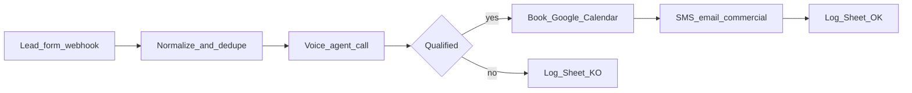

# Spec MVP — workflow rappel < 5 min

Stack cible : **Vapi ou Retell + Twilio + n8n/Make + Google Calendar + Sheet**.

## Flux

## Triggers acceptés (par ordre de facilité)
1. Webhook formulaire (Meta Lead Ads, site WordPress, Typeform)
2. Email inbound parsing (lead email → webhook)
3. Google Sheet append row
4. Forward d’appel / SMS (phase 2)

## Nœuds n8n / Make
1. **Webhook** — reçoit `name, phone, city, source, raw`
2. **Normalize** — E.164 FR (`+33...`), drop si pas de téléphone
3. **Dedupe** — ignore si même téléphone < 60 min
4. **Get slots** — Google Calendar freebusy, prochaines 2–4 dispo
5. **Call agent** — API Vapi/Retell avec prompt PAC + slots
6. **Branch** — `qualifie` true/false
7. **Create event** — Calendar + invites optionnelles
8. **Notify** — SMS Twilio commercial + email récap
9. **Log** — append Sheet `leads_log`

## SLA
- Du webhook à l’initiation d’appel : **< 60 s**
- Du lead à RDV confirmé (si joint) : **< 5 min**

## Sheet `leads_log` colonnes
`timestamp, client_id, lead_name, phone, source, joint, qualifie, rdv_iso, raison_ko, duree_sec, raw_json`

## Checklist technique avant 1ère démo
- [ ] Numéro Twilio FR actif
- [ ] Agent vocal FR testé sur 5 appels
- [ ] Calendar connecté
- [ ] Webhook public HTTPS
- [ ] Notif commercial reçue
- [ ] Enregistrement / consentement conforme à votre process client

## Export JSON minimal Make/n8n
Voir [workflow.n8n.json](workflow.n8n.json) — squelette importable à compléter avec les credentials.
